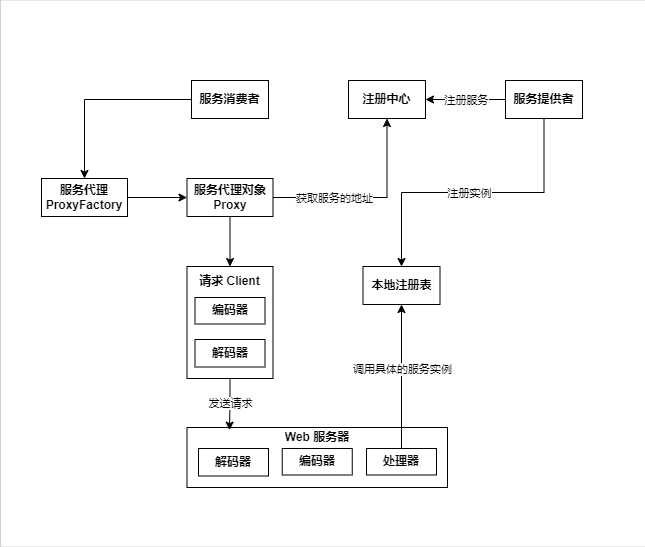

# jRPC - 一款高性能 RPC 框架
## 项目介绍
jRPC 是一款基于 Java + Etcd + Vert.x 的高性能 RPC 框架，支持服务注册、服务发现、负载均衡、重试、容错、自定义协议等特性。另外，框架采用 Java SPI 机制让开发者可以自行扩展功能，并提供了 Spring Boot Starter 注解驱动，让开发者简单地融合 RPC 远程调用到 Spring Boot 项目中。 
## 项目架构

## Spring Boot Starter 快速开始
> 由于 jRPC 是用的是 Etcd | Zookeeper 作为注册中心，所以在使用 Spring Boot Starter 之前需要先安装 Etcd | Zookeeper 服务
### 1. 引入 pom 依赖
```xml
<dependency>
    <groupId>bupt.edu.jhc</groupId>
    <artifactId>jrpc-spring-boot-starter</artifactId>
    <version>1.0-SNAPSHOT</version>
</dependency>
```
### 2. 配置 application.properties
```properties
rpc.name=jRPC 
rpc.version=1.0
rpc.serverHost=localhost
rpc.serverPort=8081
rpc.mock=false | true
rpc.serializer=jdk | hessian | kryo | 自定义的序列化器
rpc.registryConfig.registry=etcd | zookeeper | 自定义的注册中心
rpc.registryConfig.address=注册中心地址
rpc.loadBalancer=roundRobin | random | consistentHash | 自定义的负载均衡器
rpc.retryStrategy=no | fixedInterval | 自定义的重试策略
rpc.tolerantStrategy=failFast | failSafe | 自定义的容错策略
```
### 3. 相关注解使用
#### @EnableRPC：注解在 Spring Boot 启动类上，用于开启 RPC 功能
```java
@SpringBootApplication
@EnableRPC
public class ExampleSpringbootProviderApplication {
    public static void main(String[] args) {
        SpringApplication.run(ExampleSpringbootProviderApplication.class, args);
    }
}
```
#### @RPCService：注解在服务提供者的接口实现类上，用于暴露服务
```java
@Service
@RPCService
public class UserServiceImpl implements UserService {
    @Override
    public User getUser(User user) {
        System.out.println("用户名：" + user.getName());
        return user;
    }
}
```
#### @RPCReference：注解在服务消费者的接口上，用于引用服务
```java
@Service
public class ExampleServiceImpl {

    /**
     * 使用 RPC 框架注入
     */
    @RPCReference
    private UserService userService;

    /**
     * 测试方法
     */
    public void test() {
        var user = new User();
        user.setName("JollyCorivuG");
        var resultUser = userService.getUser(user);
        System.out.println(resultUser.getName());
    }

}
```